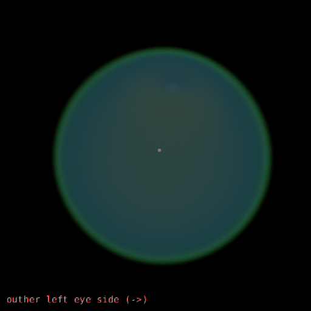
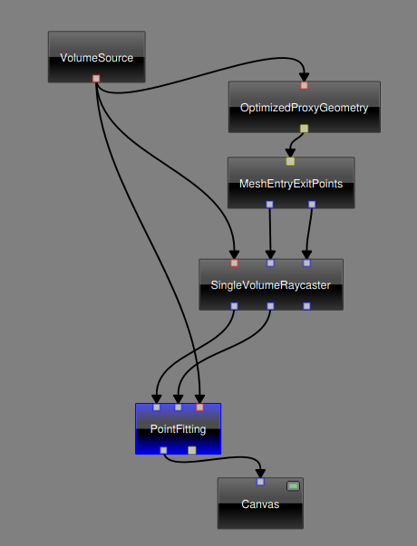
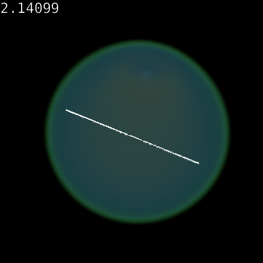
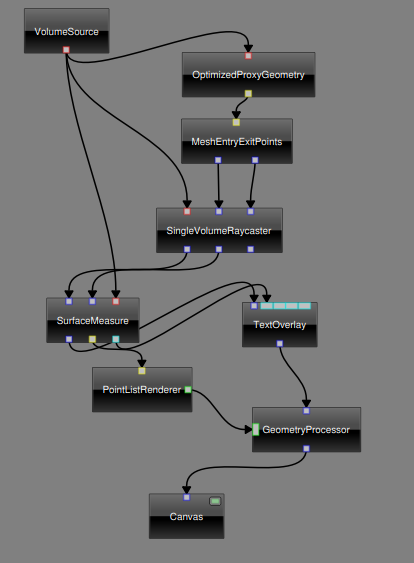

  
# POI-Toolbox

This toolset was developed to select points of interest on 3D surfaces. It is integrated in the voreen toolbox (voreen.uni-muenster.de)

## Quick start

1. Download and extract voreen: [Voreen download](http://voreen.uni-muenster.de)
2. Navigate to the custommodules directory inside the extracted voreen directory
3. Clone this repository inside the custommodules directory **or** Download this repo as ZIP and move the extracted poitools directory into the custommodules directory
4. Enable "VRN_MODULE_POITOOLS=ON" in the build options in cmake.
5. Compile the project

## About

This toolset currently contains two processors:

* pointfitting
* surfacemeasure

This toolset is compatible to the latest voreen version (5). [Voreen download](http://voreen.uni-muenster.de)

## Usage

After connecting the network and loading the mandatory points file simply press the ALT key and use the left mouse button to select points. If you want to deselect points use ALT key and right mouse button. The ALT key could be set to a different key in the settings.

There are two example workspaces contained which show the usage. 
Once voreen is compiled with the module, the fastest way to get started is:
* Load the animation example workspace.
* Remove all processors not visible in the example images below
* Add the missing processors
* Set one output of the SingleVolumeRaycaster to FHP.
* Connect the network as shown in the examples

## Pointfitting

The pointfitting processor is used to mark a set of predefined points in a 3D-Object. It is currently used to mark points to create a 3D-model. To mark the points, you have to load a mandatory points file. This file is a simple txt file which contains the mandatory points line by line. The selected points can be exported into a simple csv format seperated by spaces.

### Example mandatory points file

See example.txt

### Network setup

## Surfacemeasure

The surfacemeasure processor enables voreen to calculate the distance of two points on the surface of an object. It utilizes the line integral between the two points.

### Network setup

## Known errors

The surfacemeasure processor is currently using a linear function to determine the path between the points. If a part of the path on the 3D-object is covered, the distance is not calculated correctly.
